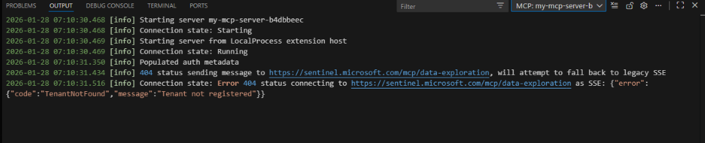
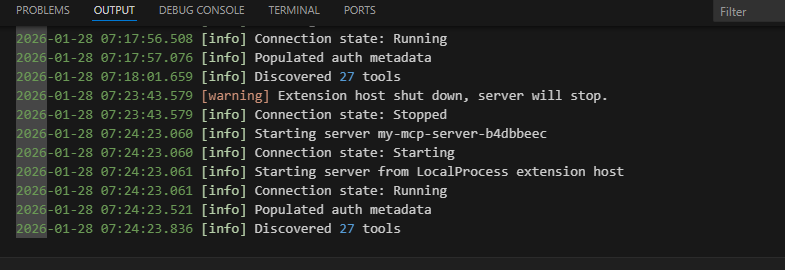
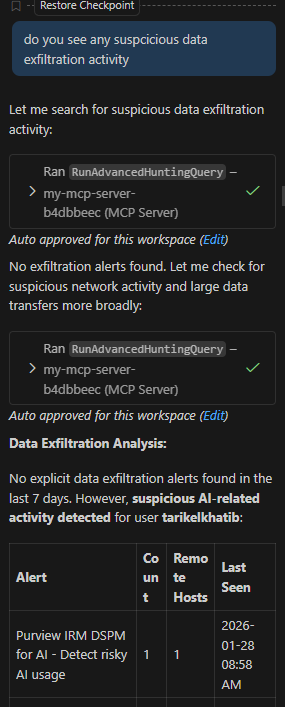
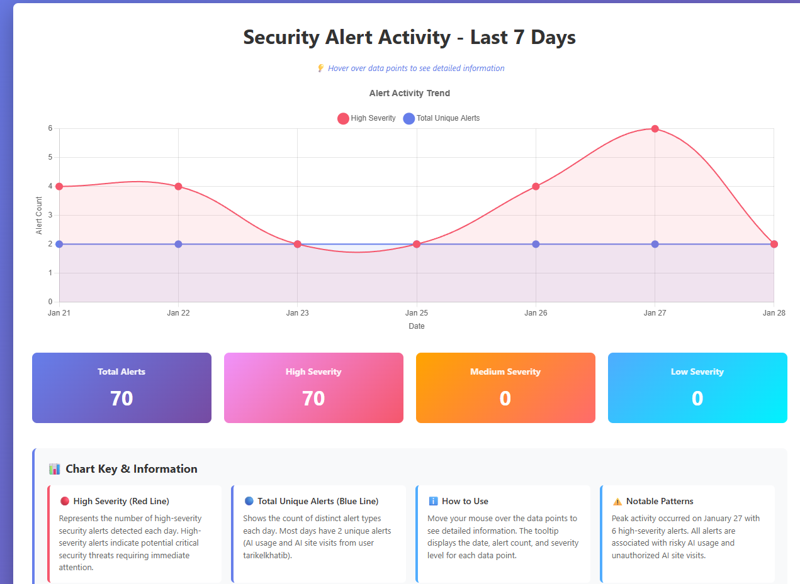

# 🚀 Setting Up My First Microsoft Sentinel MCP Server  
### (Using the Official Hosted TRIAGE Endpoint)

> **Author:** Tarik Elkhatib  
> **Focus:** Microsoft Sentinel + MCP + AI Security Automation  
> **Use Case:** SOC Triage + Alert Trend Dashboards  
> **Status:** Working ✅

---

## 📌 Overview

If you’ve been watching the rise of **LLM-powered security workflows**, you’ve probably heard about the **Model Context Protocol (MCP)** — a new standard that allows AI agents to securely interact with real security tooling.

Recently, I set up my very first **Microsoft Sentinel MCP server integration** inside Visual Studio Code.

Within minutes, I was:

✅ Running live Sentinel triage queries  
✅ Generating automated summaries  
✅ Building interactive security dashboards  
✅ Turning an AI agent into a SOC assistant  

This write-up documents exactly what I did, the issues I hit, and the real-world use case that made it click.

---

## ✅ What is Microsoft Sentinel MCP?

Microsoft Sentinel MCP is a hosted tool collection that allows AI agents (Copilot, Claude, etc.) to interact with Sentinel through natural language.

Instead of manually writing KQL every time, you can ask questions like:

- “Summarize alert activity over the last week”
- “Show me high-severity incidents today”
- “Build a chart of web-related detections”

MCP acts as the bridge between:

> **AI Agent → Sentinel Tools → Real Security Data**

This is one of the clearest examples of how SOC workflows are evolving into **conversational threat hunting**.

---

## 🎯 Why I Wanted This

My goal was simple:

✅ Set up Sentinel MCP successfully  
✅ Confirm live query execution  
✅ Build a real SOC reporting workflow  
✅ Turn AI into a Sentinel triage assistant  

This wasn’t just experimentation — I wanted something operational.

---

## ⚙️ Step 1 — My First MCP Server Setup in VS Code

MCP servers are registered through an `mcp.json` configuration file in VS Code.

At first, I tried connecting to the **data exploration** endpoint:

```json
{
  "servers": {
    "my-mcp-server": {
      "url": "https://sentinel.microsoft.com/mcp/data-exploration",
      "type": "http"
    }
  }
}
````

---

## 🚧 Step 2 — The Problem: Data Lake Was Not Enabled

Immediately, I hit an error:

```
TenantNotFound — Tenant not registered  
Error 404 connecting…
```

📸 Screenshot:



This turned out to be an important lesson:

---

### ✅ The Data Exploration MCP Endpoint Depends on Sentinel Data Lake

The **data-exploration** MCP endpoint is tied to Microsoft Sentinel Data Lake onboarding.

If your Sentinel environment does **not** have Data Lake configured yet, this endpoint will fail to initialize correctly.

So in my case, the fix was simple:

> I switched to the official hosted TRIAGE MCP server instead.

---

## ✅ Step 3 — Correct Fix: Use the Official Sentinel TRIAGE MCP Endpoint

Since I didn’t have Data Lake enabled, I updated my configuration to the supported triage endpoint:

```json
{
  "servers": {
    "my-mcp-server-b4dbbeec": {
      "url": "https://sentinel.microsoft.com/mcp/triage",
      "type": "http"
    }
  }
}
```

📸 Screenshot:


---

### Why Triage Works Better as a Starting Point

The triage endpoint is designed for:

* Alert investigation
* Incident response workflows
* SOC triage operations
* Defender + Sentinel hunting context

And once I made this change…

✅ MCP server connected immediately
✅ Tools were discovered successfully
✅ AI agents could begin executing Sentinel workflows

---

## ✅ Successful MCP Connection

Once connected, VS Code confirmed:

* MCP running ✅
* Tools discovered ✅
* Queries executing ✅

📸 Screenshot:



---

## 💬 Step 4 — Running My First Prompt in Copilot Chat

Once MCP was active, I opened Copilot Chat in **Agent mode** and asked:

> “Build me a web activity chart over the last week.”

The agent immediately executed Sentinel triage queries through MCP:

✅ Ran `RunAdvancedHuntingQuery`
✅ Retrieved alert activity by day
✅ Summarized high-severity detections

📸 Screenshot:



This was the moment it clicked:

> This wasn’t a demo anymore — this was live SOC automation.

---

## 📊 Step 5 — Real Use Case: Weekly Alert Activity Dashboard

Instead of stopping at raw KQL output, I wanted a real deliverable:

A visualization showing alert volume trends over the last 7 days.

The MCP agent generated an HTML dashboard with:

* Daily alert counts
* High-severity trend lines
* Key insights
* Severity breakdown

Example output:

| Date   | Total Alerts | High Severity |
| ------ | ------------ | ------------- |
| Jan 21 | 2            | 4             |
| Jan 22 | 2            | 4             |
| Jan 27 | 2            | 6             |
| Jan 28 | 2            | 2             |

Key insight:

✅ Peak high-severity alert volume on January 27
✅ Alerts were consistently HIGH severity
✅ Clear triage pattern worth deeper investigation

---

## ✨ Step 6 — Improving Interactivity (Hover Tooltips + Legend)

At first, the chart looked good — but it wasn’t fully interactive.

So I asked:

> “Make it so when I hover over data points it shows detailed info and include a legend/key.”

The updated dashboard now included:

✅ Hover tooltips
✅ Legend explaining alert types
✅ Chart interpretation section
✅ True SOC-ready visualization

📸 Screenshot:



---

## 🔥 Why Sentinel MCP Matters for SOC Teams

This workflow unlocks an entirely new Sentinel operating model:

### Before MCP

* Analyst logs into portal
* Writes KQL manually
* Copies results
* Builds reports separately

### With MCP + AI Agent Mode

* Ask in natural language
* Sentinel triage queries execute instantly
* AI summarizes findings
* Dashboards generate automatically

This is:

> **Security Operations at AI speed**

---

## 🛡️ Practical Sentinel MCP Triage Use Cases

Once connected, the triage endpoint enables workflows like:

### Incident Response

* “Summarize top incidents today”
* “Show affected users and devices”

### Insider Risk Signals

* “Unusual login patterns this week”
* “Web activity alerts tied to risky users”

### Alert Engineering

* “Which rule is firing most?”
* “Identify noisy detections”

### Reporting Automation

* Weekly alert dashboards
* Executive SOC summaries

---

## ✅ Final Thoughts

Setting up my first Sentinel MCP server showed me the next evolution of SOC operations:

* AI agents can run real triage workflows
* Querying becomes conversational
* Dashboards become automatic deliverables
* Analysts become supervisors, not button-clickers

And the biggest lesson:

> If you don’t have Sentinel Data Lake enabled yet, start with the official TRIAGE MCP endpoint first.

---

## 🚀 What I’m Building Next

Next up:

* Insider threat triage prompt packs
* Scheduled Sentinel MCP weekly reporting
* Full SOC agent playbooks (Sentinel + Defender + Purview)
* Production security hardening guidance

---

⭐ If you found this useful, feel free to fork or adapt.

```

---

# ✅ What You Should Do Next (Quick)

### 1. Add the screenshots folder:

```

screenshots/

````

### 2. Upload the 5 screenshots using the filenames above

### 3. Commit and push:

```bash
git add .
git commit -m "Add full blog README + screenshots"
git push
````

---


**“Make this repo MVP-level polished with banners + prompt pack.”**
